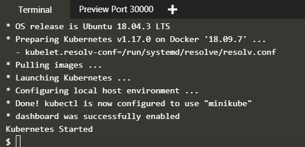
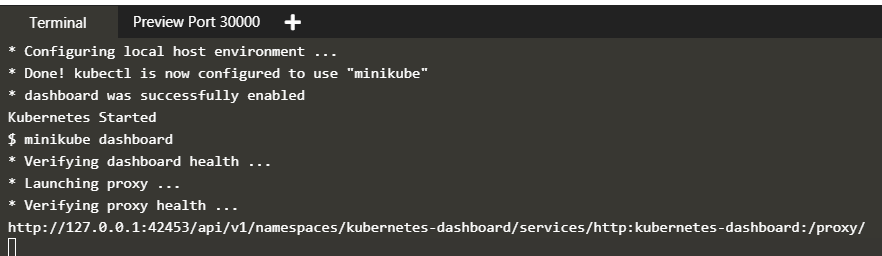
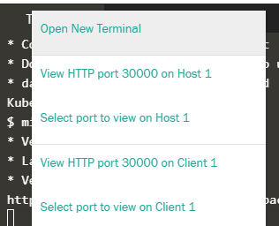
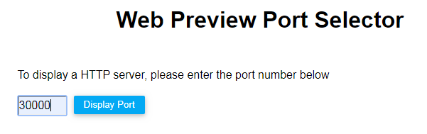

# Hello Minikube

1.	Membuat cluster minikube
	Click Launch Terminal
	
	Akan tampil terminal berikut :
	

2.	Buka dasbor kubernetes di browser
	Ketikan minikube dashboard
	

3.	Pada bagian atas panel terminal, klik tanda plus pada sebelah kanan preview port
	Kemudian akan tampil :
	
	Pilih Select port to view on Host 1
	
4.	Ketik 30000, dan kemudian klik Display Port.
	

	

