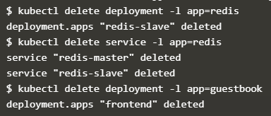

# Deploying PHP Guestbook application with Redis

Sumber		: https://googleweblight.com/i?u=https://kubernetes.io/docs/tutorials/stateless-application/guestbook/&hl=id-ID

Tutorial ini menunjukkan bagaimana membangun dan menggunakan aplikasi web multi tier yang sederhana menggunakan Kubernetes dan Docker.
Contoh ini terdiri dari komponen-komponen berikut :
1.	Master Redis instance tunggal untuk menyimpan entri buku tamu
2.	Beberapa instance Redis yang direplikasi untuk menyajikan bacaan
3.	Beberapa contoh web fronted

### Memulai Redis Master
	Aplikasi buku tamu menggunakan Redis untuk menyimpan datanya. Ia menulis datanya ke instance master Redis dan membaca data dari beberapa instance slave Redis.

1.	Membuat Redis Master Deployment
•	Buka Jendela terminal direktori tempat mengunduh file manifest
•	Terapkan Redis Master Deployment redis-master-deployment.yaml file :
    Ketikan perintah  kubectl get pods
	
•	Permintaan daftar Pods untuk memverifikasi bahwa Redis Pod sedang berjalan :
	
•	Jalankan perintah berikut untuk melihat log dari Redis Master Pod :
	kubectl logs -f POD-NAME
	
	
	
2.	Menciptakan Layanan Master Redis
•	Terapkan Layanan Redis Master berikut ini redis-master-service.yaml file :
	
•	Query daftar layanan untuk memverifikasi bahwa Layanan Redis Master sedang berjalan :
	Ketikan perintah berikut : kubectl get service
	

### Memulai Redis Slave 
	Meskipun master Redis adalah pod tunggal, Anda dapat membuatnya sangat tersedia untuk memenuhi permintaan lalu lintas dengan menambahkan Redis Slaves.
1.	Membuat Redis Slave
•	Menerapkan Redis Slave Deployment dari redis-slave-deployment.yaml file :
	
•	Query daftar pods untuk memverifikasi bahwa Redis Salves Pods sedang berjalan.
	Ketikan perintah : kubectl get pods
	

2.	Menciptakan Layanan Redis Slave
•	Apply Layanan Redis Slave berikut ini redis-slave-sirvice.yaml file :
	
•	Query daftar layanan untuk memverifikasi bahwa layanan Redis Slave sedang berjalan
	Ketikan peritah berikut : kubectl get services
	

### Atur dan Paparkan Fronted Buku Tamu
	Aplikasi buku tamu memiliki antarmuka web yang melayani permintaan HTTP yang ditulis dalam PHP. Dikonfigurasi untuk terhubung ke internet redis-master layanan untuk permintaan tulis dan layanan redis-slave untuk permintaan baca. 
1.	Membuat Buku Tamu Frontend Deployment
•	Terapkan penepatan frontend dari frontend-deployment.yaml file :

	
•	Query daftar pods untuk memverifikasi bahwa tiga replica frontend sedang berjalan
	Ketikan perintah : kubectl get pods -l app=guestbook -l tier=frontend
	
	

2.	Membuat Frontend Service
	redis-slave dan redis-master layanan yang diterapkan hanya dapat diakses dalam cluster container karena tipe default untuk layanan adalah ClusterIP.
	Cluster IP memberikan alamat IP tunggal untuk set Pods yang ditunjuk layanan. Alamat IP ini hanya diakses di dalam cluster.
	Jika ingin para tamu dapat mengakses, maka harus mengkonfigurasi frontend service agar dapat dilihat secara eksternal, sehingga klien dapat meminta layanan dari luar cluster container. Minikube hanya dapat mengekspos layanan melalui NodePort.
•	Terapkan frontend service dari frontend-service.yaml
	
•	Query daftar layanan untuk memverifikasi bahwa frontend service sedang berjalan
	Ketikan perintah : kubectl get services
	

3.	Melihat frontend service dari NodePort
	Jika menggunakan aplikasi ini ke minikube atau cluster local, maka perlu menemukan alamat IP untuk melihat buku tamu.
•	Jalankan perintah berikut untuk mendapatkan alamat IP untuk frontend service
	
•	Salin alamat IP dan muat halaman di browser untuk melihat buku tamu.

4.	Melihat frontend service dari LoadBalancer
•	Jalankan perintah berikut untuk mendapatkan alamat IP untuk frontend service
	
•	Salin alamat IP eksternal , dan muat pada halaman browser untuk melihat buku tamu

### Skala Frontend Web
	Menaikkan atau menurunkan mudah karena server didefinisikan sebagai layanan yang menggunakan deployment controller.
•	Jalankan perintah berikut untuk meningkatkan jumlah frontend pods
	
•	Query daftar pods untuk memverifikasi jumlah frontend pods yang sedang berjalan
	Ketikan perintah : kubectl get pods
	
•	Jalankan perintah berikut untuk menurunkan jumlah frontend pods
	Ketikan perintah : kubectl scale deployment frontend --replicas=2
	
•	Query daftar pods untuk memverifikasi jumlah frontend pod yang berjalan
	Ketikan perintah : kubectl get pods
	

### Cleaning Up
	Menghapus penyebaran dan layanan, juga meghapus pod yang berjalan gunakan label untuk menghapus banyak sumber daya dengan satu perintah.
•	Jalankan perintah berikut untuk menghapus semua pods, penyebaraan dan layanan
	
•	Query daftar pods untuk memverifikasi bahwa tidak ada pods yang berjalan :
	

